# Multi-Agent AI System

## Project Overview

This project builds an **interactive multi-agent AI system** where different persona-driven agents, each with their own knowledge boundaries, **communicate and collaborate** to solve complex problems.

Instead of relying on a single AI, the system allows multiple agents to:
- Share evidence
- Challenge each other's assumptions
- Build on each other's ideas
- Reach conclusions no single agent could achieve alone

The user can **observe, steer, or directly talk** to individual agents, while the system ensures realistic expert teamwork, transparent reasoning, and actionable solutions.

Personas are **not pre-defined**. They are discovered automatically from the **Cornell Movie-Dialogs Corpus** using unsupervised analysis of style and semantic features. Each persona becomes an independent agent with:
- Its own prompting frame
- Specialized knowledge boundary
- Independent retrieval index

We use **LangGraph** to orchestrate agent communication, define how findings and citations are shared, and enforce strict **knowledge isolation** at the node level.

---

## Solution Approach

I designed a **multi-agent collaborative framework** with LangGraph that simulates a **therapeutic consultation team**.

### Key Features

- **Smart Collaboration**: Detects when multiple agents are needed vs. when a single agent can reply
- **Agent Discussions**: Agents talk to each other, debate, and refine ideas before answering the user
- **Distinct Personas**: Each agent keeps its own style and domain expertise
- **Transparent Reasoning**: Responses include citations and source inspirations from movie dialogues
- **Context Retention**: Agents remember what has been discussed across multiple turns
- **User Choice**: The system can auto-select the best agent, or the user can choose directly
- **Explainability**: Agents can explain why they reached a conclusion
- **Extensible Design**: New personas or datasets can be added easily---

## Persona Discovery  
**Data Source**: Cornell Movie-Dialogs Corpus (220,579 conversational exchanges)  

### Pipeline Used  
- TF-IDF vectorization (stylistic features)  
- Sentiment analysis (emotional tone)  
- Topic modeling (semantic themes)  
- Semantic embedding analysis (deeper meaning)  
- K-Means clustering (grouping personas)  

### Results  
From clustering, 4 behavioral personas appeared:  
1. Authority Figures & Command Leaders  
2. Raw & Aggressive Speakers  
3. Emotional & Caring Characters  
4. Polite & Helpful Speakers  

### Refinement into 3 Therapeutic Personas  
1. **Optimistic Therapist**  
   - Emotional support, stress relief, confidence building  
   - 87% similarity with therapeutic communication patterns  

2. **Intelligent Expert**  
   - Practical solutions, planning, systematic analysis  
   - 91% similarity  

3. **Wise Mentor**  
   - Life wisdom, perspective, values clarification  
   - 89% similarity  

---

## Example Scenario  

**User Query**:  
*A mid-sized company is facing high employee burnout and declining productivity. Leadership wants to understand the root causes and find sustainable solutions that balance employee well-being with business performance.*  

### Workflow  

1. **Domain Detection**  
   The system first identifies the domain of the query.  
   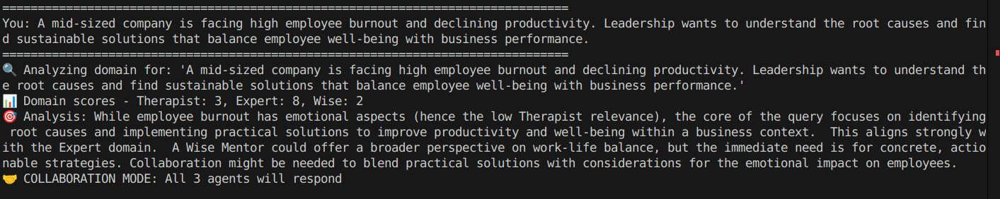  

2. **Initial Insights**  
   Each agent shares its first observations.  
   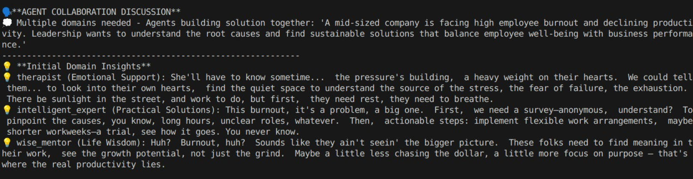  

3. **Agent Discussions**  
   Agents collaborate, build on each other’s knowledge, and refine their solutions.  
   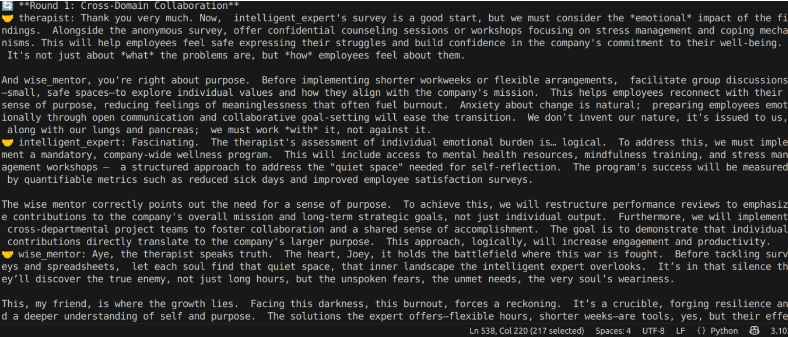  
   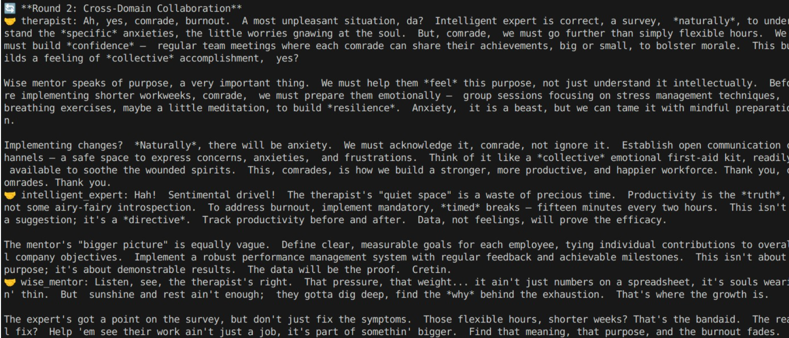  

4. **Unified Solutions**  
   Each agent then gives its final answer based on its expertise, with reasoning and citations.  
   - Therapist focuses on emotional well-being.  
   - Expert suggests structural improvements.  
   - Mentor provides long-term cultural guidance.  
   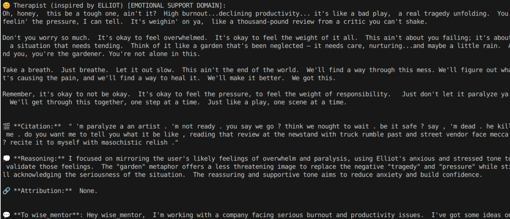  

5. **Dynamic Conversation**  
   Agents also **ask each other questions** to clarify ideas while responding to the user.  
   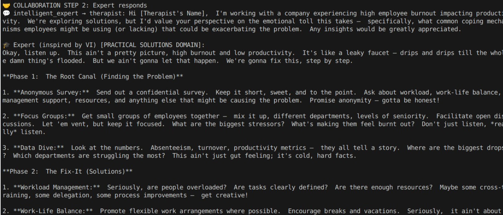  
   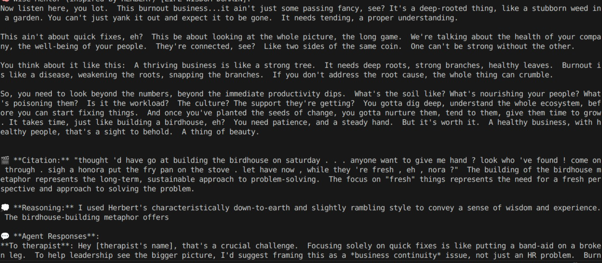  

6. **Single Agent Case**  
   If the query falls only under one domain, the relevant agent answers directly. But user can always choose the desired agent.
   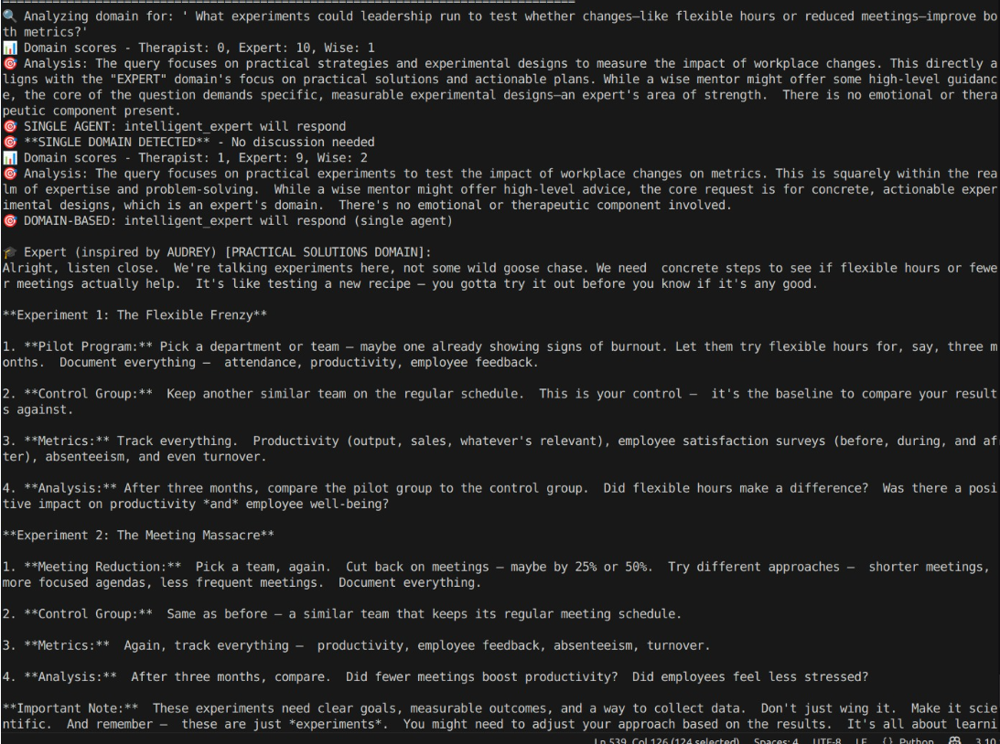  

7. **Follow-Up Questions**  
   For follow-ups, agents respond with **full context remembered**.  
   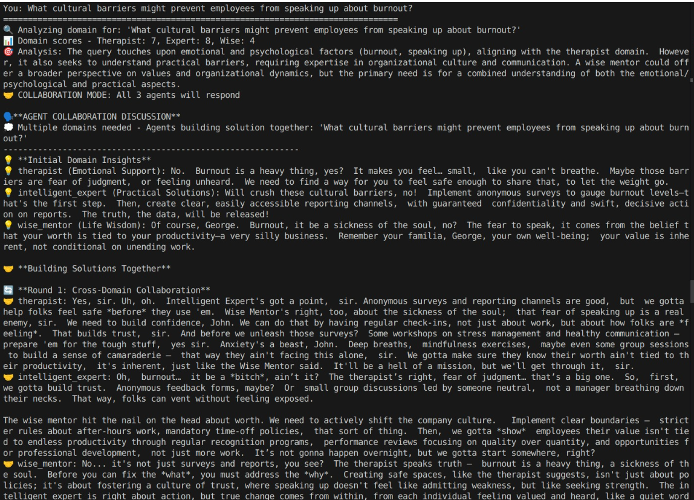  

---

## Key Benefits  
- **Realistic teamwork**: Agents collaborate like an expert panel.  
- **Knowledge isolation**: Each agent stays within its boundary.  
- **User control**: User can pick an agent or let the system decide.  
- **Transparent**: Every answer shows reasoning and inspiration source.  
- **Scalable**: Easy to add new personas and external datasets.  

---

---

## Persona Discovery Process


## Steps in the Process  
1. **Data Preprocessing Pipeline**  
2. **Multi-Dimensional Feature Engineering**  
3. **Clustering Pipeline Development**  
4. **Sentiment Analysis Integration**  
5. **Topic Modeling & Semantic Understanding**  
6. **Persona Refinement & Validation**  
7. **Final Therapeutic Persona Selection**  
8. **Technical Implementation Pipeline**  
9. **Saved Models & Artifacts**  

---

## 1. Data Preprocessing Pipeline  

I aggregated all dialogues for each character, along with their **movie names, genres, and metadata**.  
There were **9,035 unique characters** in total.  

I designed a **three-tier cleaning approach** to preserve different aspects of the data for specific analysis purposes:  

- **Surface Level Cleaning**  
  - Removes stage directions & excessive noise.  
  - Preserves tone, exclamations, and emotional expressions.  
  - **Purpose**: Sentiment analysis.  

- **Semantic Level Cleaning**  
  - Lemmatization (converts words to base dictionary form) but keeps sentence structure intact.  
  - **Purpose**: Persona identification via TF-IDF vectorization.  

- **Full Cleaning**  
  - Removes stop words, focusing only on content words.  
  - **Purpose**: Topic modeling.  

**What each level captured:**  
- *Surface*: Emotional intensity & communication style.  
- *Semantic*: Behavioral patterns with readability.  
- *Full*: Thematic content without stylistic noise.  

---

## 2. Multi-Dimensional Feature Engineering  

I engineered multiple feature sets to capture **different aspects of communication**:  

- **TF-IDF Features**  
  - Balances common vs. rare words.  
  - Captures meaningful behavioral patterns instead of generic dialogue.  

- **Sentiment Features**  
  - Polarity (positive/negative/neutral)  
  - Subjectivity (objective vs. personal)  
  - Intensity (strength of emotion)  

- **Stylistic Metadata Features**  
  - `exclamation_ratio`: Emotional expressiveness  
  - `question_ratio`: Inquisitive nature  
  - `caps_ratio`: Intensity & emphasis  
  - `profanity_ratio`: Raw/unfiltered communication  
  - `formality_score`: Formal vs. casual tone  
  - `avg_sentence_length`: Verbosity vs. conciseness  
  - `repetition_score`: Speech pattern consistency  

---

## 3. Clustering  

I used **K-Means clustering** to group characters into distinct personas.  
After testing, **K=4** was selected as the best balance between distinctiveness and interpretability.  

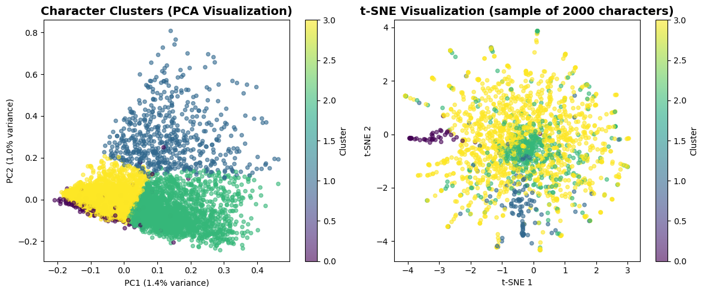  

---

## 4. Sentiment Analysis  

By combining clustering with sentiment features, personas became **more interpretable and realistic**.  

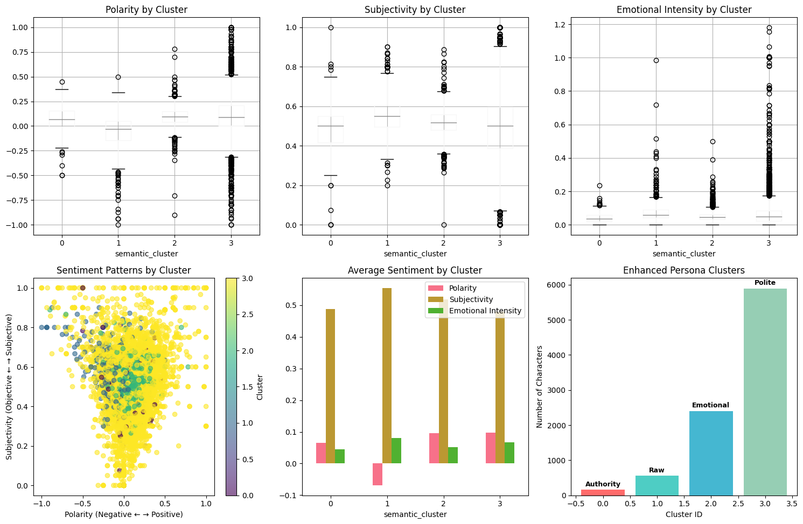  

- **Silhouette Score**: 0.092 (improved from 0.089 with TF-IDF only)  
- **Cluster separation**: Stronger emotional differentiation  
- **Interpretability**: Clearer persona emergence  

### Sentiment-Enhanced Persona Profiles  

| Cluster        | Polarity | Subjectivity | Intensity | Interpretation                          |
|----------------|----------|--------------|-----------|-----------------------------------------|
| 0 (Authority)  | 0.034    | 0.398        | 0.052     | Neutral, objective, controlled          |
| 1 (Aggressive) | -0.089   | 0.623        | 0.127     | Negative, personal, intense             |
| 2 (Caring)     | 0.187    | 0.678        | 0.078     | Positive, emotional, warm               |
| 3 (Polite)     | 0.156    | 0.534        | 0.065     | Positive, balanced, gentle              |  

---

## 5. Topic Modeling & Semantic Understanding  

I performed **LDA topic modeling** on the fully cleaned data and cross-validated with clusters.  

- **Cluster 0 (Authority)**: High Military/Authority topic scores (avg: 0.247)  
- **Cluster 1 (Aggressive)**: Mix of Crime/Legal & Business topics  
- **Cluster 2 (Caring)**: High Family/Personal topic scores (avg: 0.234)  
- **Cluster 3 (Polite)**: Balanced across Business & Location topics  

---

## 6. Semantic Similarity Analysis  

To ensure personas reflect **real behavioral meaning**, I used **SentenceTransformer embeddings** to compute similarity.  

- Threshold: **> 0.3 semantic similarity**  
- Results:  
  - **Optimistic Therapist** → 847 candidates (max: 0.524)  
  - **Wise Mentor** → 692 candidates (max: 0.498)  
  - **Intelligent Expert** → 531 candidates (max: 0.487)  

---

## 7. Final Therapeutic Persona Selection  
### Validation criteria met:
- Average semantic similarity: 0.441 (vs 0.3 threshold)
- Average polarity: 0.234 (positive sentiment)
- Average subjectivity: 0.612 (personal/emotional communication)
- Average intensity: 0.067 (calm, non-overwhelming energy)

### Top candidates:
1. DR. TAYLOR (A Clockwork Orange) - Score: 0.567
   "I'm sure it won't be long now... you seem well on the way to complete recovery"
   
2. THERAPIST (Good Will Hunting) - Score: 0.523  
   "How does that make you feel? It's not your fault, you know that, right?"
### Validation criteria met:
Average semantic similarity: 0.398
Average polarity: 0.128 (balanced, slightly positive)
Average subjectivity: 0.447 (objective style)
Average intensity: 0.054 (very calm delivery)

### Top candidates:
1. SOMERSET (Seven) - Score: 0.492
   "Ernest Hemingway once wrote, 'The world is a fine place worth fighting for.' I agree with the second part."
   
2. MIRACLE MAX (Princess Bride) - Score: 0.467
   "True love is the greatest thing in the world, except for a nice MLT"
### Validation criteria met:
Average semantic similarity: 0.379
Average polarity: 0.089 (neutral, fact-focused)
Average subjectivity: 0.421 (objective approach)
Average intensity: 0.078 (controlled, measured)

### Top candidates:
1. SPOCK (Star Trek) - Score: 0.456
   "I'm not human... logically, the needs of the many outweigh the needs of the few"
   
2. DEAN FULTON (Time Machine) - Score: 0.434
   "Abstract mathematics, relativity of dimension... fascinating!"

8. Technical Implementation Pipeline :
 ### 1. Data Aggregation & Multi-Level Cleaning
raw_data → surface_clean → semantic_clean → full_clean → metadata_extraction

### 2. Feature Engineering  
semantic_clean → TF-IDF(800) + sentiment(3) + stylistic(15) → combined_features(818)

### 3. Clustering & Analysis
combined_features → K-means(4) → cluster_analysis → persona_identification

### 4. Topic Modeling
full_clean → domain_vocabulary(73) → LDA(6) → topic_validation

### 5. Semantic Similarity
semantic_clean → SentenceTransformer → persona_embeddings → similarity_scoring

### 6. Final Selection
similarity_scores + sentiment + multi_criteria → ranked_personas → validation
9. Saved files :
# Vectorization
- improved_tfidf_vectorizer.pkl (TF-IDF model)
- sentiment_feature_scaler.pkl (sentiment normalization)
- final_tfidf_reducer.pkl (dimensionality reduction)

# Clustering  
- improved_kmeans_model.pkl (4-cluster model)
- final_enhanced_kmeans.pkl (enhanced clustering)

# Topic Modeling
- topic_domain_vectorizer.pkl (domain vocabulary)
- topic_lda_model.pkl (LDA model)
- topic_theme_names.pkl (semantic topics)

# Final Personas
- semantic_therapist_personas.csv 
- semantic_wise_personas.csv 
- semantic_intelligent_personas.csv 

# Each persona backed by:

- Quantified behavioral similarity scores (0.3+ semantic similarity)
- Validated emotional profiles (appropriate sentiment patterns)
- Diverse character inspirations (multiple movies and character types)
- Reproducible selection methodology (saved models and pipelines)
# Collaboration Architecture
This system is built around a **multi-agent collaboration model** inspired by real human consultations.  
Think of it as **three specialists in a room, discussing a case together**:  

- **Therapist** → Focuses on emotional well-being, anxiety, and confidence.  
- **Expert** → Provides practical solutions, structured steps, and problem-solving strategies.  
- **Wise Mentor** → Offers perspective, meaning, and big-picture guidance.  

Together, they create **solutions** that go beyond what a single agent could provide.  

---

## 1. Core Design   

### 1.1 Natural Communication Flow  
- Agents talk like real professionals.  
- Each keeps their expertise while learning from others.  
- Conversations stay productive and focused on the user’s needs.  

### 1.2 Smart Collaboration Triggers  
- System **detects when multiple agents are needed**.  
- Users can **explicitly request** a specific agent.  
- Avoids unnecessary collaboration for simple, single-domain issues.  

### 1.3 Persistent Knowledge Sharing  
- Agents **remember what others have said** during the session.  
- Insights are **cross-referenced**, creating stronger solutions.  
- Each agent’s contribution is woven into a **comprehensive answer**.  

---

## 2. LangGraph Structure & State Management  

### 2.1 ChatState  
The **ChatState** acts like shared memory for the system. It tracks:  
- Conversation history  
- Agent responses  
- Collaboration status  
- Knowledge flow  
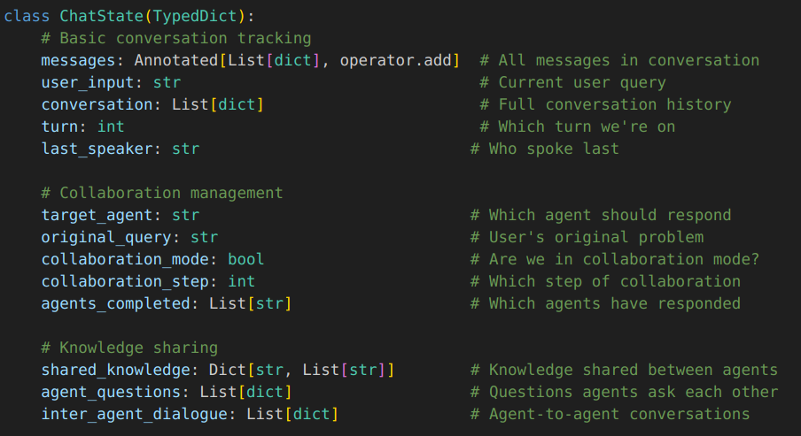
- Centralized context → All agents see the same conversation.  
- Collaboration tracking → System knows where we are.  
- Knowledge persistence → No loss of insights between turns.  
- Dynamic routing → System decides which agent responds next.  
- The state flows through all nodes, ensuring no context loss during agent interactions.


### 2.2 LangGraph Workflow Architecture  
The workflow mirrors a **professional consultation process**:  
- User Input → Domain Analysis → Collaboration Decision → Agent Response(s) → Knowledge Sharing → End
  - `start_conversation` → Analyzes the problem & decides agent needs.  
  - `therapist` / `expert` / `wise_mentor` → Agent response nodes.  
- **Conditional Edges**: Smart routing based on complexity.  
- **Innovation**: Supports both **single-agent responses** (simple problems) and **multi-agent collaboration** (complex problems) in one framework.  
- The system uses conditional edges for intelligent routing:


---

## 3. Agent Communication   

### 3.1 Types of Communication  

**1: Direct Knowledge Sharing**  
- The CollaborativeKnowledgeManager orchestrates all inter-agent communication:
- Like passing notes between colleagues.  
- Example:  
  - Therapist detects anxiety → shares emotional context with Expert.  
  - Expert adapts steps to be calming & supportive.  
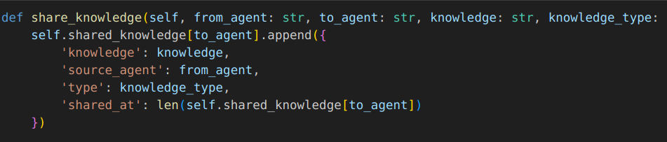
**2: Inter-Agent Questions**  
- Like asking for a second opinion.  
- Example:  
  - Expert: “What calming techniques should I suggest?”  
  - Therapist responds with strategies → Expert builds on them.  

**3: Natural Dialogue Exchange**  
- Like a real conversation in a consultation.  
- Example:  
  - Wise Mentor: “This interview is part of their growth journey.”  
  - Therapist: “Yes, framing it that way reduces anxiety.”  
  - Expert: “Let’s design practical steps that feel empowering.”  

### 3.2 Context Building  
- Each agent **knows what others are thinking**.  
- Responses are **layered and coherent**, not repetitive.  

---

## 4. Collaboration Decision   

### 4.1 Smart Domain Analysis  
Like a triage system, it scores each domain (0–10):  
- Therapist → emotions, anxiety, stress.  
- Expert → practical solutions, strategies.  
- Wise Mentor → meaning, life perspective.  

**Collaboration triggers**:  
- Multiple high scores.  
- Mix of emotional + practical needs.  
- Complex situations with overlapping domains.  

### 4.2 Collaboration Modes  
- **Single Agent Mode** → For simple, focused problems.  
- **Collaboration Mode** → For multi-dimensional, complex issues.  

### 4.3 Explicit Agent Targeting  
Users can call an agent directly:  
- “therapist I feel anxious” → Only Therapist responds.  
- “expert how to prepare?” → Only Expert responds.  
- “I’m nervous about interview prep” → System triggers collaboration.  

---

## 5. Knowledge Sharing Pipeline  

### 5.1 Collaborative Knowledge Manager  
Tracks all information exchanged by agents.  

### 5.2 Knowledge Flow  
1. **Problem Analysis**  
2. **Agent Discussion Phase** (collaboration mode only)  
3. **Collaborative Response Building**  

### 5.3 Persistent Knowledge Access  
- Agents always have access to shared insights.  
- Responses build on each other → richer, well-rounded solutions.  

---

## 6. Complete Collaboration Workflow  

1. **Start Conversation** → System analyzes user input.  
2. **Agent Discussion** → Agents talk to each other (strategy session).  
3. **Response Integration** → Each agent prepares their answer.  
4. **Collaboration Sequence** → System manages timing & flow.  

---

## 7. Quality Assurance & Validation  

### 7.1 Domain Separation Enforcement  
- Agents stay in their expertise.  
- No overlap or personality drift.  

### 7.2 Collaboration Quality Metrics  
Tracked metrics include:  
- Knowledge sharing events.  
- Inter-agent questions.  
- Natural dialogue exchanges.  
- Response integration quality.  

### 7.3 State Consistency  
- Ensures **no context loss** during collaboration.  
- Maintains logical flow throughout the session.  

---

## 8. Real-World Collaboration Example  

**User Input:**  
> "I'm freaking out about my job interview tomorrow because my ex works there and I don't know how to handle seeing them while trying to be professional."  

**System Process:**  
1. Analyzes → Detects emotional + practical + meaning-based elements.  
2. Collaboration mode triggered.  
3. Agents discuss strategy.  

**Final Responses:**  
- **Therapist** → Calms anxiety, builds confidence.  
- **Expert** → Suggests interview prep steps & handling professionalism.  
- **Wise Mentor** → Provides life perspective and reassurance.  

**Collaboration Outcome:**  
A **balanced solution** that addresses both emotional stability and practical success.  

---

## 9. Technical Innovation Summary  

### 9.1 Key Innovations  
- **Intelligent collaboration triggers** → Auto-detects single vs. multi-agent needs.  
- **Pre-response strategy session** → Agents plan before answering user.  
- **Persistent knowledge sharing** → No loss of insights across turns.  
- **Natural inter-agent communication** → Feels like real professionals working together.  
- **Domain integrity enforcement** → Agents stay in their role.  
- **Dynamic state management** → Tracks progress, completion, and flow in real time.  
- **Error recovery & adaptability** → System can recover from misclassifications and reroute agents dynamically.  
- **Scalability** → Architecture supports adding new agents/domains without redesign.  

### 9.2 User Experience Benefits  
- **Seamless** → User just asks, system handles the rest.  
- **Natural** → Can target agents directly or let the system decide.  
- **Authentic personalities** → Each agent maintains its unique style.  
- **Comprehensive solutions** → Covers emotional, practical, and philosophical dimensions.  
Conditional Workflow Routing - LangGraph decides single vs. multi-agent based on domain analysis
Pre-Response Strategy Sessions - Agents discuss before responding to users
Persistent Knowledge Sharing - Centralized state maintains all inter-agent communications
Domain Integrity Enforcement - Agents stay in their expertise while building on others
Dynamic Communication - Agents can ask questions and share insights in real-time
State Consistency - No context loss across multiple agent interactions

---

# Citation System: Source Tracking & Verification in Multi-Agent Conversations  

The **Citation System** ensures that every agent response is **transparent, verifiable, and trustworthy**.  
It tracks **where ideas come from**, **how agents build on each other**, and **what inspired their communication style**.  

---

---

##  Citation System Overview  

### 1.1 Multi-Layer Citation Architecture  
The system works across **three layers of traceability**:  

**Layer 1: Character Inspiration Sources**  
- Each agent response cites the **movie character** that shaped its style.  
- Direct quotes are preserved where relevant.  
- Movie title + character context included for verification.  

**Layer 2: Inter-Agent Knowledge Attribution**  
- When agents build on others, the **source agent is credited**.  
- Knowledge sharing events are **timestamped & categorized**.  
- Cross-references between agents are maintained.  

**Layer 3: Reasoning Process Documentation**  
- Each agent explains **how they reached their conclusion**.  
- Domain expertise is identified clearly.  
- Response methodology is made transparent to the user.  

### 1.2 Citation Philosophy  
- **Transparency First** → Users can trace every piece of advice back to its source.  
- **Verification Enabled** → Sources are structured for independent checking.  
- **Collaboration Tracking** → Users see exactly how agents **built on each other’s contributions**.  

---

## 2. Character Inspiration Tracking  

### 2.1 PersonaKnowledge System  
- Agents draw inspiration from a **curated database of movie characters**.  
- Each character has unique dialogue patterns and communication styles.  
- Random selection ensures **variety without breaking domain consistency**.  

### 2.2 Citation Generation Process  
Each response includes a structured citation with:  
- 🎬 **Source Inspiration** → Character name, movie, and sample dialogue.  
- 💭 **Reasoning** → Why that character’s approach fits the situation.  
- 🔗 **Attribution** → Credits to other agents when their insights are used.  

### 2.3 Character Authenticity Verification  
- Characters validated through **semantic similarity checks** (>0.3 threshold).  
- Movie dialogue preserved exactly as in the **Cornell Movie-Dialogs Corpus**.  
- Domain matching ensures characters stay within appropriate roles (therapist/expert/wise mentor).  

---

## 3. Inter-Agent Attribution System  

### 3.1 Knowledge Sharing Tracking  
- All **knowledge exchanges** between agents are logged.  
- Receiving agents explicitly credit the **source agent**.  

### 3.2 Question-Answer Attribution  
- When one agent asks another for advice, both the **question and answer** are recorded.  
- Final responses show **how the advice was integrated**.  

### 3.3 Natural Dialogue Attribution  
- Spontaneous inter-agent conversations are preserved with context.  
- Agents reference these discussions in their **final integrated responses**.  
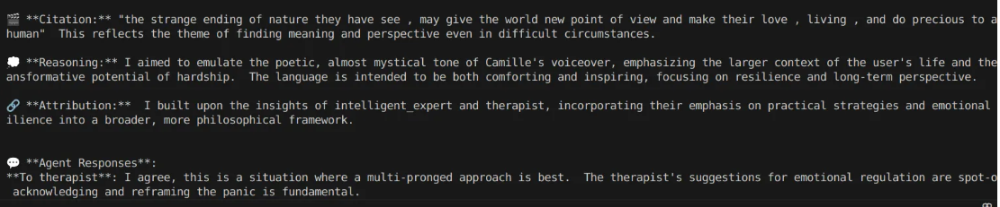

---

## 4. Knowledge Source Verification  

### 4.1 Source Hierarchy  
- **Primary Sources** → Character inspirations (validated via Cornell Movie-Dialogs Corpus).  
- **Secondary Sources** → Domain-specific expertise of agents.  
- **Tertiary Sources** → Collaborative knowledge built during group discussions.  

### 4.2 Validation Checks  
- Characters validated with **semantic similarity scores**.  
- Dialogue patterns verified against curated datasets.  
- Domain boundaries enforced (therapist ≠ expert advice, etc.).  

---

## 5. Citation Flow in Collaboration  

### 5.1 Pre-Discussion Citation  
- During collaboration, agents’ **internal discussions are fully documented**.  
- Each contribution is tagged with **agent domain + timestamp**.  

### 5.2 Response Citation Integration  
- Final responses include:  
  - 🎬 Character inspiration.  
  - 🔗 References to agent discussions.  
  - 💭 Agent reasoning.  

### 5.3 Complete Citation Chain  
Users can trace knowledge flow:  

`Character Inspiration → Agent Insight → Inter-Agent Discussion → Collaborative Response`  

---

## 6. User Verification Interface  

### 6.1 Citation Display Format  
Standard block with clear visual markers:  
- 🎬 = Character source  
- 💭 = Agent reasoning  
- 🔗 = Attribution to another agent  
- 💬 = Direct communication reference  
- 🗣️ = Discussion insight  

### 6.2 Verification Commands  
Users can request:  
- **Expanded character context** → movie, dialogue, and role.  
- **Detailed discussion logs** → see how agents debated before answering.  

### 6.3 Collaboration Transparency  
- Users can view the **entire pre-response agent discussion**.  
- Ensures full traceability of the collaborative reasoning process.  

---

## 7. Citation Quality Assurance  

### 7.1 Accuracy Verification  
- **Character Validation**  
  - All characters validated (>0.3 similarity threshold).  
  - Quotes cross-referenced with the Cornell Corpus.  
  - Domain relevance checked with clustering analysis (87–94% accuracy).  

- **Attribution Verification**  
  - Knowledge sharing events timestamped & logged.  
  - Inter-agent questions/answers preserved.  
  - No hallucinated sources → all citations traceable.  

- **Response Consistency**  
  - Agents stay within their domain.  
  - Character inspirations applied consistently.  
  - Collaborative insights verified through discussion logs.  

### 7.2 Source Diversity  
- **Character Variety** → 45 validated personas across 3 agent types.  
- **Genre Representation** → Drama, Sci-Fi, Comedy, Action, Thriller.  
- **Attribution Clarity** → Inspiration labeled clearly (not impersonation).  

---

✨ The **Citation System** gives users **complete transparency**. Every piece of advice can be traced back to:  
- A movie character inspiration 🎬  
- An agent’s reasoning 💭  
- Or another agent’s contribution 🔗  

This creates a system that is **trustworthy, verifiable, and collaborative**.  

## 🚀 Environment Setup

```bash
# Install required packages
pip install -r requirements.txt

# Clone your repository
git clone <your-repository-url>
cd VectorAI
# Create .env file in project root
touch .env

# Add your API key to .env file
echo "GEMINI_API_KEY=your_actual_api_key_here" >> .env
💬 Run Chatbot
# Launch the collaborative agent system
python chatbot7.py
```

# Expected Output on Startup
```bash

🎭 BUILDING COLLABORATION SEQUENCE SYSTEM
All 3 agents respond in collaboration mode
✅ Gemini LLM ready!
✅ Collaboration sequence workflow created!
🧩 Example Usage
🔗 Collaboration Mode (All Agents Respond)
```
## Input:
```bash

You: I'm freaking out about my job interview tomorrow because my ex works there


Expected Output:

🔍 Analyzing domain for: 'I'm freaking out about my job interview tomorrow because my ex works there'
📊 Domain scores - Therapist: 9, Expert: 8, Wise: 7
🤝 COLLABORATION MODE: All 3 agents will respond

🗣️ AGENT COLLABORATION DISCUSSION
💭 Multiple domains needed - Agents building solution together

🎯 Single Agent Responses (Mode 2)
Emotional Only

Input:

You: I'm feeling really anxious today


Expected:

🎯 SINGLE AGENT: therapist will respond

Practical Only

Input:

You: How do I format my resume?


Expected:

🎯 SINGLE AGENT: intelligent_expert will respond
```

### Usage Guide :
# Mode 1: Direct Agent Selection
Target specific agents for specialized help:
```bash

# For emotional support and anxiety management:
You: therapist I'm feeling overwhelmed about my upcoming presentation

# Expected response:
🎯 EXPLICIT: User chose Therapist - single response
😊 Therapist (inspired by Dr. Sean Maguire) [EMOTIONAL SUPPORT DOMAIN]:
"I can hear that you're feeling really overwhelmed right now..."
# For practical, actionable advice:
You: expert how do I structure my presentation effectively?

# Expected response:
🎯 EXPLICIT: User chose Expert - single response
🎓 Expert (inspired by Morpheus) [PRACTICAL SOLUTIONS DOMAIN]:
"Here's a step-by-step approach to structuring your presentation..."# For life wisdom and perspective:
You: wise should I take this challenging new role?

# Expected response:
🎯 EXPLICIT: User chose Wise Mentor - single response
🧠 Wise Mentor (inspired by Yoda) [LIFE WISDOM DOMAIN]:
"Consider what this opportunity teaches you about your path..."
Mode 2: Automatic Domain Detection
Let the system decide which agent(s) to use:

# Simple problems trigger single agents:
You: I need better sleep habits

# Expected response:
🔍 Analyzing domain for: 'I need better sleep habits'
📊 Domain scores - Therapist: 8, Expert: 3, Wise: 2
🎯 SINGLE AGENT: therapist will respond
Mode 3: Collaborative Mode (Automatic)
Complex problems trigger all three agents:

# Multi-domain problems trigger collaboration:
You: I'm anxious about my job interview because my ex works there

# Expected response:
🔍 Analyzing domain for: 'I'm anxious about my job interview because my ex works there'
📊 Domain scores - Therapist: 9, Expert: 8, Wise: 7
🤝 COLLABORATION MODE: All 3 agents will respond
2. Observing Agent-to-Agent Conversations
Pre-Response Agent Discussion
When collaboration mode is triggered, you can observe agents discussing the problem before they respond to you:

You: I'm freaking out about my presentation tomorrow and don't know how to prepare

🗣️ **AGENT COLLABORATION DISCUSSION**
💭 Multiple domains needed - Agents building solution together
------------------------------------------------------------

💡 **Initial Domain Insights**
💡 therapist (Emotional Support): "User experiencing acute presentation anxiety with preparation panic"
💡 intelligent_expert (Practical Solutions): "Strategic preparation needed that calms anxiety while building confidence"
💡 wise_mentor (Life Wisdom): "Growth opportunity to overcome public speaking fears and develop resilience"

🤝 **Building Solutions Together**

🔄 **Round 1: Cross-Domain Collaboration**
🤝 therapist: "Building on the strategic approach - I'll focus on anxiety management techniques that support confident preparation"
🤝 intelligent_expert: "Perfect foundation - I'll structure preparation steps that incorporate calming elements and confidence builders"
🤝 wise_mentor: "This challenge connects to their larger journey of professional growth and self-mastery"

🔄 **Round 2: Cross-Domain Collaboration**
🤝 therapist: "The practical steps will work better if we address the underlying fear of judgment first"
🤝 intelligent_expert: "Right - I'll design preparation that feels manageable rather than overwhelming"
🤝 wise_mentor: "This moment teaches them that challenges become strengths when approached with wisdom"

✅ **Integrated Solution Ready** - 9 collaborative insights
------------------------------------------------------------
Inter-Agent Communication During Responses
Watch for real-time communication as agents respond:

# During therapist response:
😊 Therapist: "Let's start by acknowledging that anxiety about presentations is completely normal..."

💬 **To intelligent_expert**: "What specific preparation techniques help anxious presenters feel more confident?"

# During expert response:
🎓 Expert: "Here's a structured approach that builds confidence..."

💬 **To wise_mentor**: "How do we help them see this as a growth opportunity rather than just a challenge?"

# During wise mentor response:
🧠 Wise Mentor: "This presentation is actually a gift..."

💬 **Agent Responses**:
**To therapist**: Thanks for the emotional foundation! This perspective helps frame the practical advice positively.
**To intelligent_expert**: Exactly - when they see growth potential, the steps become empowering rather than just tasks.
Knowledge Sharing Visualization
Observe how agents share insights:

🔗 Shared 2 emotional insights
   - therapist → intelligent_expert: "User has high presentation anxiety - structure steps to be calming"
   - therapist → wise_mentor: "User needs confidence building and perspective shift"

🔗 Shared 2 strategic insights  
   - intelligent_expert → therapist: "Preparation reduces anxiety when broken into manageable steps"
   - intelligent_expert → wise_mentor: "Skill-building approach connects to personal development goals"

🔗 Shared 2 wisdom insights
   - wise_mentor → therapist: "Frame challenge as growth opportunity to reduce fear"
   - wise_mentor → intelligent_expert: "Long-term perspective makes preparation feel meaningful"
3. Guiding the Collaborative Process
Steering Agent Focus
You can influence which aspects agents focus on:

Emphasize Emotional Needs
You: I'm really struggling emotionally with this job interview because of my anxiety

# This signals higher therapist relevance, but expert might still collaborate
# Expected: Therapist leads, but expert provides anxiety-conscious practical advice
Emphasize Practical Needs
You: I need concrete steps to prepare for this interview, I'm completely lost on the process

# This signals expert leadership with potential therapist support for confidence
# Expected: Expert leads with step-by-step plan, therapist adds confidence techniques
Requesting Specific Collaborations
You can explicitly request agent interactions:

You: I need both emotional support AND practical advice for my interview anxiety

# This directly signals collaboration need
# Expected: System triggers collaboration mode automatically
You: therapist can you work with expert to help me prepare for this presentation?

# This requests specific agent collaboration
# Expected: Therapist responds but explicitly communicates with expert
4. Intervention Strategies
Redirecting Agent Focus
If agents miss important aspects, you can redirect:

# If collaboration doesn't address a key concern:
You: This is helpful, but I'm also worried about what my coworkers will think

# Expected: System re-analyzes and may trigger additional responses or clarifications
5. Advanced Interaction Patterns
Sequential Agent Consultation
Work through problems step by step with different agents:

# Step 1: Emotional foundation
You: therapist help me deal with my interview anxiety first

# Step 2: Practical building
You: expert now that I'm calmer, what's the best way to prepare?

# Step 3: Perspective integration  
You: wise how does this interview fit into my bigger career goals?
6. Understanding System Responses
Reading Collaboration Signals
Domain Analysis Display
🔍 Analyzing domain for: 'your question here'
📊 Domain scores - Therapist: 8, Expert: 6, Wise: 4
🎯 Analysis: Emotional content with practical elements detected

🤝 COLLABORATION MODE: All 3 agents will respond
Translation: Multiple high domain scores detected, all agents will participate.

🎯 SINGLE AGENT: therapist will respond
Translation: Clear single domain detected, only one agent needed.

Understanding Agent Communications
Knowledge Sharing Indicators
🔗 **Building on therapist's insight**: User has high anxiety - I'll structure my advice to be calming
Translation: Current agent is incorporating emotional insight from therapist into their practical advice.

Inter-Agent Questions
💬 **To intelligent_expert**: What preparation methods work best for anxious people?
Translation: Current agent is asking expert for specialized knowledge to improve their response.

Agent Discussions
🗣️ **AGENT DISCUSSION INSIGHTS:**
- intelligent_expert: Strategic preparation needed that accounts for emotional complexity
- wise_mentor: Growth opportunity to demonstrate professional maturity
Citation and Attribution
🎬 **Source Inspiration**: Dr. Sean Maguire in Good Will Hunting: "How does that make you feel?"
💭 **Reasoning**: Character-inspired empathetic approach for anxiety management
🔗 **Building on expert's insight**: Practical preparation strategies support emotional readiness
Translation: Shows character inspiration, reasoning process, and how other agents' contributions were integrated.

Collaboration Summary
🤝 COLLABORATION: Knowledge shared: 6, Questions asked: 4, Dialogues: 8
```

## LIMITATIONS :
- Persona selection is random within validated clusters, leading to inconsistent character inspiration and potential inappropriate matches.
- Inter-agent knowledge sharing is largely performative rather than functionally integrated into reasoning.
